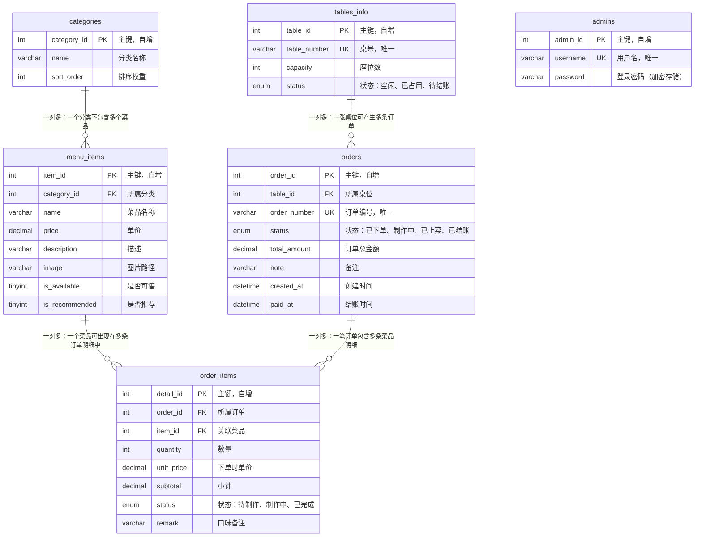

# 顾客堂食点餐系统 - 数据库 ER 图

> 本文档展示 dine_in_system 数据库的实体关系图，包含 6 张核心表及其关联关系。

## 表关系汇总

| 主表 | 从表 | 关系类型 | 外键 | 说明 |
|------|------|----------|------|------|
| categories | menu_items | 一对多 | category_id | 一个分类下有多个菜品 |
| menu_items | order_items | 一对多 | item_id | 一个菜品可被多次点单 |
| tables_info | orders | 一对多 | table_id | 一张桌位可有多笔订单 |
| orders | order_items | 一对多 | order_id | 一笔订单可有多个菜品明细 |

## 状态流转说明

- **桌位状态**: `空闲` -> `已占用`（顾客入座） -> `待结账`（请求买单） -> `空闲`（结账完成）
- **订单状态**: `已下单` -> `制作中` -> `已上菜` -> `已结账`
- **订单明细状态**: `待制作` -> `制作中` -> `已完成`
